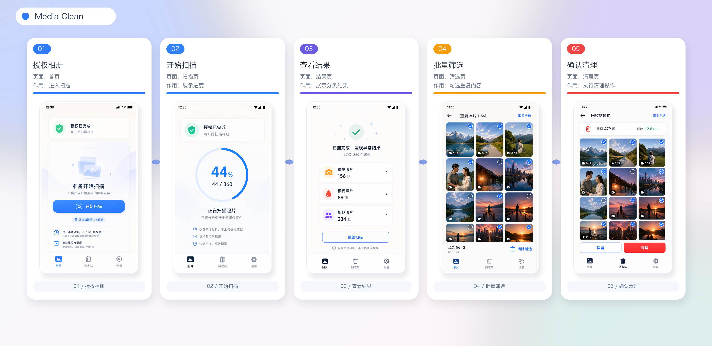

# Media Clean

[English README](./README.en.md)

Media Clean 是一个 本地相册识别与清理工具。它面向家庭手机相册中长期堆积的误触视频、模糊照片、相似照片、重复内容和低信息媒体，目标是把“扫描 -> 识别 -> 筛选 -> 清理 -> 报告”做成稳定、可恢复、可解释的本地清理流程。

产品官网：[https://mc.jerret.me](https://mc.jerret.me)


<video controls width="100%" src="./page/public/promo-video-60fps.mp4">
  当前阅读器不支持内嵌视频播放。
</video>


## 当前产品功能



Media Clean 当前功能可以归纳为四条主线：本地扫描识别、可解释异常结果、应用内回收站清理、可恢复的扫描体验。产品面向“让你的相册焕然一新”，以本地安全为前提，把误触视频、模糊照片、相似照片、重复内容和低信息媒体整理成用户可判断、可恢复、可最终清理的候选结果。

<details>
<summary>产品详情介绍</summary>

### 扫描与识别

1. 申请照片和视频读取权限，并在本地读取媒体元数据。
2. 默认扫描最近 12 个月，设置页支持 `1 / 2 / 3 / 6 / 12` 个月窗口。
3. 当前批次带明确时间范围，使用 `createdAfter` 与 `createdBefore` 控制窗口边界。
4. 完成当前窗口后，继续扫描会向更早月份回填，不循环重复扫描已完成批次。
5. 全量历史完成后进入“已完成全量扫描”状态；之后如出现新增媒体，则进入增量扫描。
6. 支持 Android 本地扫描恢复：切换页面或应用被系统中断后，重新进入可以接回当前扫描批次。
7. UI 进度和 Android 通知进度使用同一批次分子/分母口径，避免显示状态分裂。

### 本地识别能力

当前仓库第一版不上外部 AI 接口，识别以本地启发式和轻量特征为主：

1. 模糊与低质量：基于亮度、对比度、边缘密度等视觉指标生成质量判断。
2. 重复与近似重复：保留内容 hash、difference hash、图片指纹和视频关键帧指纹。
3. 误触与异常：结合媒体类型、时长、尺寸、文件体积、视觉指标和规则阈值做候选判断。
4. 分组与解释：候选项展示置信度、触发原因、媒体信息、预览和重复组上下文。
5. 结果持久化：识别结果、候选视图、用户决策和回收站状态写入本地 SQLite。

### 清理与回收站

1. 候选媒体不会被直接永久删除。
2. 高置信度候选可以批量移入应用内回收站。
3. 回收站页面承接“保留和清理”流程，支持恢复、继续保留和最终删除。
4. 永久删除需要用户二次确认，并调用系统媒体删除能力。
5. 用户决策会写入 `user_decision`，后续扫描不会覆盖用户已经做出的 keep、recycle、restore、delete 决策。
6. 回收站底部提供累计清理报告，包括累计清理数量、体积和最近清理时间。

### 设置、提醒与体验

1. 支持 `zh-CN / en-US`，默认跟随系统语言，也可以在设置中手动切换。
2. 支持深色、浅色和跟随系统主题。
3. 支持本地清理提醒，可配置频率、星期和时间。
4. 支持扫描完成通知、Android 前台扫描通知和本地提醒通知。
5. 适配刘海屏、打孔屏、安全区和折叠屏相关布局策略。
6. Android 启动屏、应用图标和发布页图标已使用当前品牌资源。

### 发布页

1. 发布页独立位于 `page/`，不与 Expo Android/iOS 构建耦合。
2. Vercel Root Directory 指向 `page` 即可独立发布。
3. 推荐 Vercel 项目名为 `mc`，预览域名为 `mc.vercel.app`，正式域名规划为 `mc.jerret.me`。
4. 详细发布契约见 [docs/release/vercel.md](./docs/release/vercel.md)，英文版见 [docs/release/vercel.en.md](./docs/release/vercel.en.md)。

</details>

## 技术架构

Media Clean 当前是 Expo / React Native 应用，Android 是主验收路径。JS 层负责控制面、界面、结果聚合和持久化协调；Android 原生层负责后台扫描执行、前台通知和本地媒体枚举；SQLite 是扫描运行时与用户决策的本地真值来源。


### 模块职责

1. `src/application/`：应用启动、偏好设置、错误边界、提醒 bootstrap 和 observability fallback。
2. `src/navigation/`：照片、回收站、设置三 Tab 导航。
3. `src/ui/`：界面组件、照片网格、扫描进度、候选卡片、详情预览和页面布局适配。
4. `src/domain/recognition/`：识别类型、视觉指标、评分与候选生成。
5. `src/features/scan/`：扫描范围、媒体读取、Android 本地扫描 facade、批次进度、运行时恢复和 staging importer。
6. `src/features/cleanup/`：候选清理状态机、保留、回收、恢复、删除动作。
7. `src/features/reminders/`：清理提醒文案、调度、后台任务和运行时 reconciliation。
8. `src/services/storage/`：AsyncStorage 兼容层、SQLite operational store、扫描任务 checkpoint、扫描范围与偏好存储。
9. `src/services/media/`：视觉分析和临时分析文件缓存管理。长期真值只应保存结果与原媒体 URI，临时文件不作为产品数据。
10. `plugins/withBackgroundScan.js`：Expo config plugin，把 Android 后台扫描原生模块、前台服务和权限注入到原生工程。
11. `android/`：当前预构建后的 Android 原生工程，用于真机构建、调试和验证。
12. `page/`：独立 Vercel 静态发布页。
13. `docs/` 与 `design/`：目标、标准、发布契约、Android-first 扫描设计和产品页面说明。

## 数据与状态口径

本项目维护一个原则：扫描状态、识别结果和用户动作不能依托 UI 层作为真值。

当前关键表与状态包括：

1. `scan_batch`：一次扫描批次的模式、时间范围、阶段、进度和完成状态。
2. `scan_batch_item`：批次内每个 asset 的分析阶段、失败原因和 heartbeat。
3. `asset_manifest`：Android 枚举得到的媒体元数据，包括 URI、类型、尺寸、时长、体积、拍摄时间、bucket、视频字段等。
4. `media_analysis`：单资源分析缓存，包括签名、指纹、hash、帧指纹和视觉指标。
5. `candidate_view`：UI 直接消费的候选视图。
6. `recognition_group / recognition_member`：重复/近似重复的 durable 分组真值。
7. `user_decision`：用户 keep、recycle、restore、delete、failed 决策。
8. `recycle_bin_state`：应用内回收站状态。
9. `cleanup_report`：累计清理数量、体积和最近清理时间。
10. `scan_job`：活跃扫描 job 的恢复 checkpoint。

## 开发环境

建议环境：

1. Node.js 与 npm。
2. Expo SDK 54 / React Native 0.81.5。
3. Android Studio、Android SDK、JDK 与可连接 Android 真机。
4. Vercel CLI，仅发布 `page/` 时需要。

安装依赖：

```bash
npm install
```

启动 Expo：

```bash
npm run start
```

运行 Android：

```bash
npm run android
```

运行 iOS 兼容路径：

```bash
npm run ios
```

当前主验收路径仍是 Android；iOS 保留 Expo 层兼容性，但不是第一版发布验收重点。

## 常用命令

### App 验证

```bash
npm run test -- --run
npm run typecheck -- --pretty false
```

### Android 构建

```bash
npm run build:android:debug
npm run build:android:release
```

当前 `build:android:debug` 与 `build:android:release` 都会直接产出 APK；若你要安装到设备调试，使用 `npm run run:android:debug`。

Android debug / release 发包、签名验签与 CI/CD 流水线见 [docs/release/android.md](./docs/release/android.md)，英文版 [docs/release/android.en.md](./docs/release/android.en.md)。

如 Gradle daemon 或 Kotlin daemon 报锁、缓存或编译 daemon 异常，优先清理/重启 Gradle daemon，再区分是环境锁、磁盘空间、网络仓库还是代码错误。

### 发布页

```bash
npm run page:build
npm run page:dev
npm run page:preview
```

生产发布：

```bash
npm run page:deploy:prod
```

Vercel 配置见 [docs/release/vercel.md](./docs/release/vercel.md)。

## 质量与验收

提交前至少执行：

```bash
npm run test -- --run
npm run typecheck -- --pretty false
npm run page:build
```

涉及 Android 原生扫描、通知、启动屏或权限时，还需要真机验证：

```bash
npm run build:android:debug
adb shell am force-stop com.jt.mistapmediacleaner
adb shell monkey -p com.jt.mistapmediacleaner 1
```

涉及发布页时，还需要：

```bash
npm run page:preview
curl -sSI http://127.0.0.1:4173/
```

验收时重点检查：

1. 扫描中切换页面再返回，仍显示当前扫描状态，而不是回到授权入口。
2. UI 进度与 Android 通知进度使用同一批次分子/分母。
3. 已完成批次不重复扫描，直接复用识别结果。
4. 全量完成后不循环继续扫描；新增媒体出现后才提示增量扫描。
5. 回收站能正常加载、恢复和永久删除。
6. 设置页提醒开关在任务不存在时不会抛出用户可见错误。
7. 发布页桌面和 mobile 布局无明显溢出、过大间距或 CTA 变形。

## 文档入口

1. 产品发布页说明：[docs/product/page-home.md](./docs/product/page-home.md)，英文版 [docs/product/page-home.en.md](./docs/product/page-home.en.md)。
2. Android 发包契约：[docs/release/android.md](./docs/release/android.md)，英文版 [docs/release/android.en.md](./docs/release/android.en.md)。
2. Vercel 发布契约：[docs/release/vercel.md](./docs/release/vercel.md)，英文版 [docs/release/vercel.en.md](./docs/release/vercel.en.md)。
3. Android 扫描与识别设计：[design/recognition-scan-android-first/README.md](./design/recognition-scan-android-first/README.md)，英文版 [design/recognition-scan-android-first/README.en.md](./design/recognition-scan-android-first/README.en.md)。
4. 执行标准：[docs/standards/execution-standards.md](./docs/standards/execution-standards.md)，英文版 [docs/standards/execution-standards.en.md](./docs/standards/execution-standards.en.md)。
5. 团队模式标准：[docs/standards/agent-team-mode.md](./docs/standards/agent-team-mode.md)，英文版 [docs/standards/agent-team-mode.en.md](./docs/standards/agent-team-mode.en.md)。
6. 发布页目录说明：[page/README.md](./page/README.md)，英文版 [page/README.en.md](./page/README.en.md)。

## 当前边界

1. 当前版本优先验证 Android，iOS 不是第一发布验收路径。
2. 公开页面如出现“AI”表达，属于产品营销口径；当前仓库实现仍以本地启发式识别为主，没有接入外部 AI API。
3. Firebase / Crashlytics / Analytics 暂不纳入当前 Android 第一版，当前 observability 可以保持 noop fallback。
4. 识别后长期只应保存结果、元数据与原媒体 URI；缩略图、帧图或临时分析文件不应作为长期产品数据。
5. Vercel 自定义域名需要在 Vercel Dashboard 添加 `mc.jerret.me` 后，再按平台提示配置 DNS。
