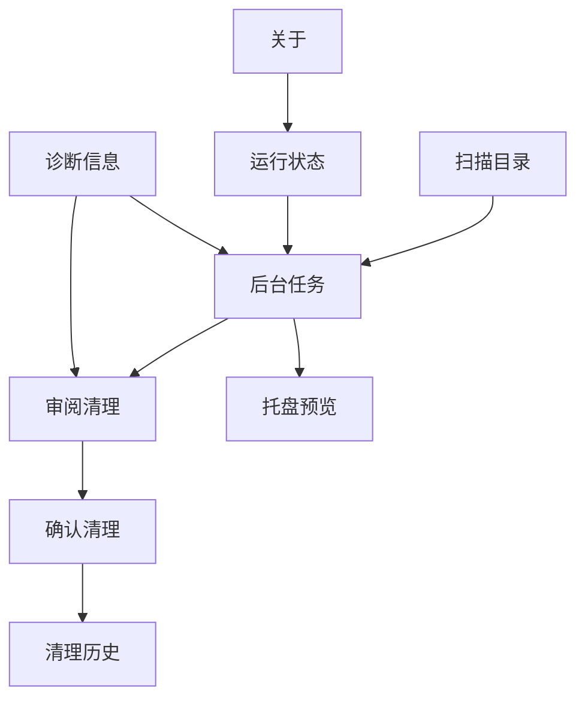
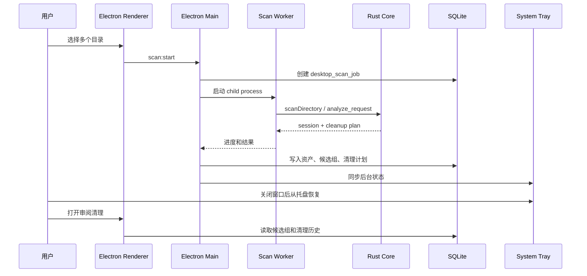

# Electron Desktop 交互收敛

> 目标：把桌面端从“技术能力导航”收敛为“用户任务导航”。用户只需要完成三件事：选择目录、等待后台扫描、审阅并清理。

## 核心决策

一级导航只保留 3 个用户任务：

1. `扫描目录`
2. `后台任务`
3. `审阅清理`

这些内容不再作为一级页面：

- `Rust Core 引擎`：放在后台任务的状态 badge、任务详情和诊断信息中。
- `SQLite 状态存储`：放在运行状态、清理历史和诊断信息中。
- `离线 ASAR 应用`：放在关于页或诊断信息中。
- `系统托盘集成`：作为后台任务的系统层延展，不单独占一个主页面。

## 信息架构

左侧导航结构：

| 区域 | 项 | 用途 |
| --- | --- | --- |
| 主任务 | 扫描目录 | 选择一个或多个目录，控制扫描范围 |
| 主任务 | 后台任务 | 查看多目录扫描进度、失败、完成和托盘状态 |
| 主任务 | 审阅清理 | 审阅候选组、批量选择、确认移入回收站 |
| 辅助 | 运行状态 | 查看 Rust Core、SQLite、ASAR、本地协议等运行状态 |
| 辅助 | 诊断信息 | 查看错误、权限、worker、package smoke 等诊断 |
| 辅助 | 关于 | 版本、隐私说明、本地处理说明 |

## 主流程

## 页面 1：扫描目录

设计图：[01-scan-directories.png](./assets/01-scan-directories.png)

### 用户目标

用户要快速选择扫描范围，并确认这些目录可以读取。

### 页面内容

- 顶部：标题、说明、`刷新`、`选择目录`。
- 已选目录列表：目录名、路径、权限、媒体数量、移除按钮。
- 扫描范围：`All`、`图片`、`视频`。
- 本地能力提示：`本地读取`、`不上传`、`app://media`、`Rust Core`。
- 权限异常：无权限目录、重新授权入口。
- 下一步提示：每个目录会变成独立后台任务。
- 主动作：`开始后台扫描`。

### 交互规则

- `选择目录` 使用系统目录选择器，支持多选。
- `追加目录` 不清空已有目录。
- `清空` 只清空当前待扫描列表，不删除历史 session。
- 有任一目录无权限时，仍允许扫描其他目录，但异常目录进入失败/待授权状态。
- 点击 `开始后台扫描` 后进入 `后台任务`。

## 页面 2：后台任务

设计图：[02-background-tasks.png](./assets/02-background-tasks.png)

### 用户目标

用户要确认扫描仍在进行、可以后台运行、失败可处理、完成后可进入审阅。

### 页面内容

- 聚合状态：目录数、扫描中、完成、失败、整体进度。
- 任务列表：每个目录一张 job card。
- 每个 job：目录名、进度、资产数量、当前阶段、暂停/详情/打开审阅。
- 任务详情：queued、worker started、Rust Core analyzing、SQLite persisted、review ready。
- 托盘行为卡：关闭窗口后继续扫描，托盘可恢复。
- 异常卡：权限失败、worker 失败、资源缺失。

### 交互规则

- 扫描任务必须独立建模，不能把多个目录揉成一个不可拆任务。
- 关闭窗口默认隐藏到托盘，不退出应用。
- `暂停全部` 只影响还在扫描中的 job。
- 单个 job 完成后可直接 `打开审阅`。
- 失败任务可以回到对应目录权限或日志。
- Rust Core、SQLite、child process 只作为任务详情信息，不占主导航。

## 页面 3：审阅清理

设计图：[03-review-cleanup.png](./assets/03-review-cleanup.png)

### 用户目标

用户要高效审阅候选组，选择要移除的文件，最后统一移入回收站。

### 页面内容

- 统计卡：Assets、Clusters、Cleanup Plans、Diagnostics。
- 分类 tab：All、重复文件、相似图片、低价值、视频。
- 搜索：文件名或 cluster id。
- 分页和批量选择：全选、全不选、60/120/240、首页/上一页/下一页/末页。
- 候选网格：2x2 缩略图、识别类型、score、文件名、候选数量、详情按钮。
- 详情面板：大图、识别原因、选择当前文件、gallery。
- 清理 dock：已选数量、涉及候选组、历史已清理、打开清理。

### 交互规则

- 默认展示可清理候选，不展示已清理候选。
- 卡片点击打开详情；checkbox 只负责选中候选。
- `shift + click` 做范围选择，`cmd/control + click` 做增量选择。
- 清理完成后，对应候选组应从当前列表移除或重新计算。
- 历史清理数量在 dock 中持续可见。

## 系统层：托盘预览

设计图：[04-tray-island.png](./assets/04-tray-island.png)

托盘不作为一级页面，它是 `后台任务` 的系统延展。

### 展示内容

- 当前状态：`正在后台扫描`、`扫描完成，待审阅`、`有任务需要处理`、`等待开始扫描`
- 关键结论：整体进度、目录数、媒体数、候选数、完成数
- 最近目录：最多展示 3 个目录，更多目录只显示汇总，避免托盘里变成完整任务页
- 主动作：根据状态切换为 `选择目录扫描`、`打开工作台` 或 `查看审阅结果`
- 辅助动作：`完成通知`、`暂停全部`、`退出 Media Clean`
- 本地安全提示：`本机处理，不上传原始媒体`

### 交互规则

- 点击托盘图标只打开 island，不直接打开主窗口。
- 右上角 `收起` 只隐藏 island，不影响后台扫描。
- 如果有已完成待审阅任务，主按钮优先进入审阅页。
- 如果仍在扫描，主按钮优先打开工作台查看后台任务。
- `退出 Media Clean` 必须是显式动作，不等同于关闭窗口。

## 加载态：骨架屏

设计图：[05-loading-skeletons.png](./assets/05-loading-skeletons.png)

骨架屏分两类：

1. 首页骨架：读取 SQLite、历史记录、后台任务时使用。
2. 审阅页骨架：读取 session、cleanup plan、候选分页时使用。

### 规则

- 不使用居中 spinner 作为主加载态。
- 骨架结构必须贴近最终页面。
- 首页骨架展示任务导航、目录选择、后台任务预览、历史记录。
- 审阅骨架展示统计卡、tab、搜索、分页、候选网格、清理 dock。

## 状态模型

| 状态 | 页面 | 用户可见反馈 | 下一步 |
| --- | --- | --- | --- |
| 无目录 | 扫描目录 | 空目录列表，选择目录按钮 | 选择目录 |
| 已选目录 | 扫描目录 | 目录列表和权限状态 | 开始后台扫描 |
| 扫描中 | 后台任务 / 托盘 | job 进度、整体进度 | 等待或隐藏窗口 |
| 部分失败 | 后台任务 | 失败卡和重新授权/查看日志 | 处理失败或继续审阅成功结果 |
| 扫描完成 | 后台任务 | 完成状态和打开审阅 | 进入审阅清理 |
| 审阅中 | 审阅清理 | 候选网格、详情、选择状态 | 打开清理 |
| 清理完成 | 审阅清理 | 历史已清理数量更新，候选移除 | 继续审阅或返回扫描 |

## 实现优先级

P0：

- 左侧导航改为 `扫描目录 / 后台任务 / 审阅清理`。
- 扫描目录页支持多目录列表和开始后台扫描。
- 后台任务页展示多 job 进度和托盘提示。
- 审阅清理页沿用 CLI report 密度。
- 托盘 popover 与后台任务状态一致。
- 首页/审阅骨架屏分别适配。

P1：

- 运行状态页。
- 诊断信息页。
- 关于页。
- 更细的失败恢复和日志入口。
