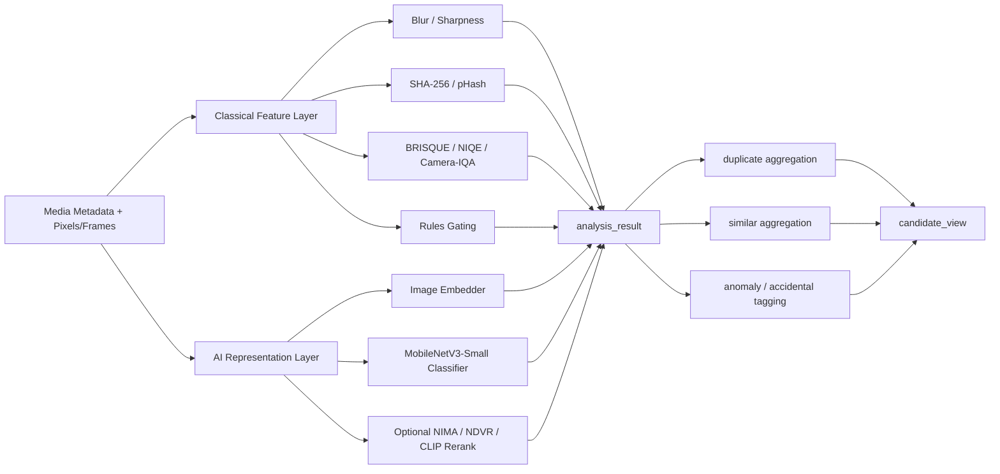
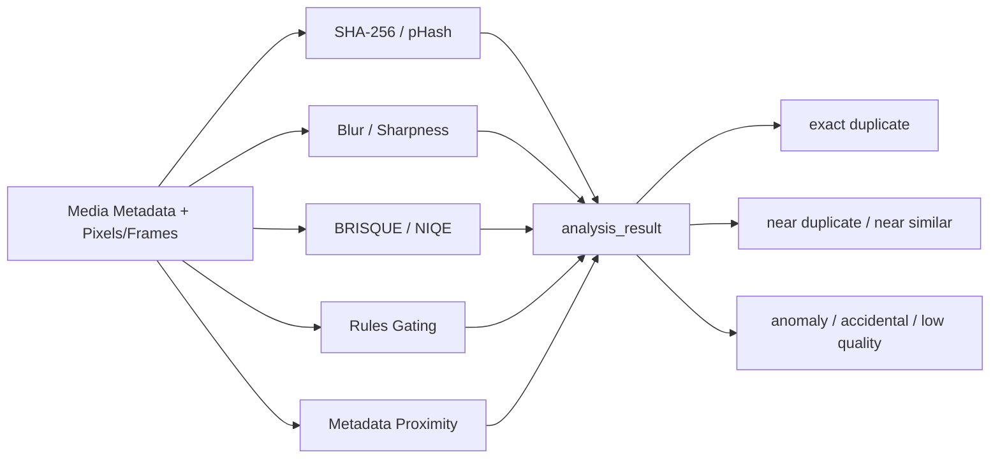

# Android Recognition Algorithm Research

中文版本: [algorithm-research.md](./algorithm-research.md)

Related documents:

- [Android Scan And Recognition Target-State Goals](./target-state-goals.en.md)
- [Android-First Scan And Recognition Architecture](./architecture.en.md)

## Scope

This document maps each recognition dimension to:

1. established algorithms
2. whether AI is justified
3. how it should be introduced on Android

## Recognition Dimensions

The target Android stack should cover:

1. `blur`
2. `duplicate`
3. `similar`
4. `accidental / low-information`
5. `heavy-noise / compression / overall low quality`

## Recommended Mapping

| Dimension | Established path | Recommendation |
| --- | --- | --- |
| Blur | JNB, HiFST, S3 | Start with classical blur and sharpness scoring |
| Duplicate | SHA-256, pHash | Exact duplicates use cryptographic hash; near-duplicates use perceptual hash |
| Similar | Embeddings + cosine similarity | Treat similarity as an embedding problem |
| Accidental | No single canonical public algorithm found in this review | Use rules plus a lightweight classifier |
| Noise / low quality | BRISQUE, NIQE, camera-captured NR-IQA, NIMA | Start with NR-IQA, add AI re-ranking later |

## First Release Decision

The current decision is: **ship v1 without AI in the critical path.**

So the first real implementation uses this non-AI stack:

1. blur: `S3 + JNB-style blur score`
2. duplicate: `SHA-256 + pHash`
3. near-similar: `pHash distance + metadata proximity + low-level feature distance`
4. accidental / low-information: `rules gating`
5. noise / low quality: `BRISQUE / NIQE`

This also narrows the meaning of similarity in v1:

- not strong semantic similarity
- yes to near-similar, burst-like, and lightly changed similarity

## Comparison Matrix

| Dimension | Algorithm | Type | Strengths | Weaknesses | Recommended role | Source |
| --- | --- | --- | --- | --- | --- | --- |
| Blur | JNB | Classical | Sensitive to slight defocus blur | More defocus-focused than general blur | Blur enhancement signal | CVPR 2015 |
| Blur | HiFST | Classical | Handles spatially varying blur without camera priors | Heavier than simple sharpness metrics | Hard-case blur evaluation | CVPR 2017 |
| Blur | S3 | Classical | Useful perceived sharpness score | More quality-oriented than segmentation-oriented | Sharpness feature | TIP 2012 |
| Duplicate | SHA-256 | Classical | Best for exact equality | Not robust to benign edits | Exact duplicate | NIST FIPS 180-4 |
| Duplicate | pHash | Classical | Efficient near-duplicate filter | Not semantic similarity | Near duplicate | pHash / Zauner |
| Similar | Embedding + cosine similarity | AI | Best fit for semantic similarity | Requires model and threshold management | Similar grouping | MediaPipe Image Embedder |
| Accidental | Rules gating | Rules | Explainable and cheap | Limited coverage | First-pass accidental filter | Design conclusion |
| Accidental | MobileNetV3-Small | AI | Mobile-friendly and extensible | Needs labels and model ops | Second-pass accidental classifier | ICCV 2019 |
| Quality | BRISQUE | Classical NR-IQA | Fast and practical | Not camera-specialized | Quality baseline | TIP 2012 |
| Quality | NIQE | Classical NR-IQA | Fully blind | Domain sensitivity | Generic quality floor | SPL 2013 |
| Quality | Camera-captured NR-IQA | Classical + ML | Better aligned with smartphone captures | More complex than BRISQUE / NIQE | Higher-trust quality score | IEEE T-CYB 2023 |
| Quality | NIMA | AI | Good for ranking and re-ranking | Extra inference cost | AI quality reranker | 2017 |

## Algorithm Architecture Diagram

## First Release Non-AI Diagram

## AI Recommendation

Recommended on-device AI stack:

1. similarity: MediaPipe `Image Embedder`
2. accidental and quality: lightweight `MobileNetV3-Small` classifier or multi-head model
3. model packaging: `.tflite` assets with versioned thresholds and delegate policy

CLIP-like embeddings are best treated as an optional higher-accuracy reranker, not the default Android real-time path.

For v1, this AI stack is deferred rather than required.

### Advantages Of Introducing AI

1. Similarity becomes meaningfully stronger than hash-only matching.
2. Accidental and low-information cases can be handled with a dedicated classifier instead of rules alone.
3. Quality ranking can move closer to human-perceived ordering.
4. New recognition dimensions can often reuse the same embedding or classifier infrastructure.

### Disadvantages Of Introducing AI

1. It adds model files, thresholds, versioning, and validation overhead.
2. It increases on-device cost in memory, power, cold start, and delegate compatibility.
3. It is less directly explainable than hashes and classical quality metrics.
4. Without labeled data and ongoing evaluation, model drift risk is higher.

### Impact On iOS

There is impact, but it should stay in the execution adapter layer rather than the recognition contract layer.

1. If Android adopts `MediaPipe / LiteRT / TFLite`, iOS will need equivalent runtime wrappers and delegate policy.
2. The durable contracts should remain platform-neutral:
   - `analysis_result`
   - `model_version`
   - `threshold_version`
   - `embedding_vector_ref`
3. iOS does not need to ship AI on day one if Android does, but the schema and batch semantics should stay compatible.
4. If Android writes AI-specific results into platform-specific objects, later iOS adoption will become much harder.

Conversely, a non-AI first release helps iOS:

1. Android and iOS can share a classical-feature contract first.
2. iOS is not blocked by Android model runtime choices.
3. Later AI adoption on iOS can extend the execution layer without redesigning the v1 schema.

## Source Mapping

| Method | Source | Role |
| --- | --- | --- |
| JNB | Shi et al., CVPR 2015 | slight defocus blur |
| HiFST | Golestaneh and Karam, CVPR 2017 | spatial blur map |
| S3 | Vu et al., TIP 2012 | sharpness score |
| SHA-256 | NIST FIPS 180-4 | exact duplicate |
| pHash | pHash docs / Zauner thesis | near duplicate |
| MediaPipe Image Embedder | Google AI Edge docs | similar grouping |
| BRISQUE | Mittal et al., TIP 2012 | quality baseline |
| NIQE | Mittal et al., SPL 2013 | generic quality floor |
| Camera-captured NR-IQA | Hu et al., IEEE T-CYB 2023 | smartphone-like quality |
| NIMA | Talebi and Milanfar, 2017 | quality re-ranking |
| MobileNetV3-Small | Howard et al., ICCV 2019 | accidental classifier backbone |

## Primary Sources

- [JNB, CVPR 2015](https://openaccess.thecvf.com/content_cvpr_2015/papers/Shi_Just_Noticeable_Defocus_2015_CVPR_paper.pdf)
- [HiFST, CVPR 2017](https://openaccess.thecvf.com/content_cvpr_2017/html/Golestaneh_Spatially-Varying_Blur_Detection_CVPR_2017_paper.html)
- [S3, TIP 2012](https://pubmed.ncbi.nlm.nih.gov/21965207/)
- [NIST FIPS 180-4](https://csrc.nist.gov/pubs/fips/180-4/upd1/final)
- [pHash](https://phash.org/docs/howto.html)
- [Zauner thesis](https://phash.org/docs/pubs/thesis_zauner.pdf)
- [MediaPipe Image Embedder](https://ai.google.dev/edge/mediapipe/solutions/vision/image_embedder)
- [MediaPipe Image Classifier Android](https://ai.google.dev/edge/mediapipe/solutions/vision/image_classifier/android)
- [TFLite Model Maker](https://ai.google.dev/edge/litert/libraries/modify/image_classification)
- [Camera-Captured NR-IQA](https://pubmed.ncbi.nlm.nih.gov/34847052/)
- [BRISQUE](https://live.ece.utexas.edu/research/quality/brisque_journal.pdf)
- [NIQE](https://live.ece.utexas.edu/research/Quality/niqe_spl.pdf)
- [NIMA](https://arxiv.org/abs/1709.05424)
- [CLIP](https://proceedings.mlr.press/v139/radford21a.html)
- [MobileNetV3](https://openaccess.thecvf.com/content_ICCV_2019/html/Howard_Searching_for_MobileNetV3_ICCV_2019_paper.html)
- [Near-Duplicate Video Retrieval With Deep Metric Learning](https://openaccess.thecvf.com/content_ICCV_2017_workshops/w5/html/Kordopatis-Zilos_Near-Duplicate_Video_Retrieval_ICCV_2017_paper.html)
