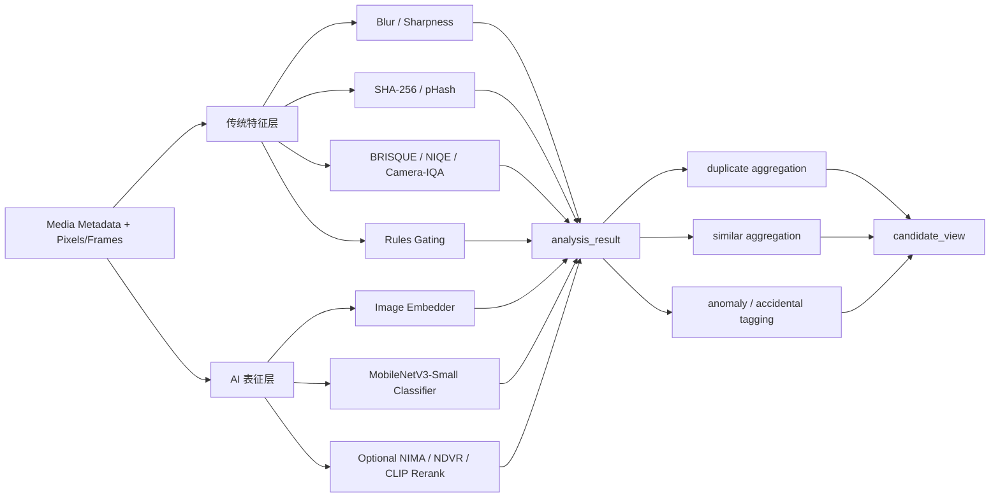
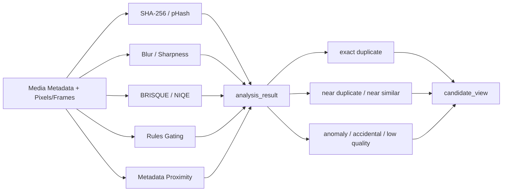

# Android 识别算法调研

English version: [algorithm-research.en.md](./algorithm-research.en.md)

关联文档：

- [Android 扫描与识别终态需求目标](./target-state-goals.md)
- [Android First 扫描与识别架构](./architecture.md)

## 背景

Android 终态识别不能只写“做模糊、做重复、做误触”，必须把每个识别维度对应到：

1. 已有权威传统算法
2. 是否值得引入 AI
3. 在 Android 本地如何落

这里先给出调研结论，再让架构文档引用这些结论。

## 维度收敛

这轮识别维度收敛为 5 类：

1. `模糊`
2. `重复`
3. `相似`
4. `误触 / 低信息`
5. `噪声重 / 压缩重 / 综合差质`

其中“噪音重”更准确应写成 **噪声重**。

## 已有算法结论

| 维度 | 权威已有算法 | 适用位置 | 结论 |
| --- | --- | --- | --- |
| 模糊 | JNB、HiFST、S3 | 单资源分析 | 有成熟传统算法，应该先落传统路径 |
| 重复 | SHA-256、pHash | exact duplicate / near duplicate | exact duplicate 用加密哈希；近重复用感知哈希 |
| 相似 | 图像 embedding + cosine similarity、视频 NDVR deep metric learning | 相似聚合 | 相似判定本质上更适合 embedding |
| 误触 / 低信息 | 公开文献里没有单一 canonical 算法 | 质量异常子类 | 推荐规则 + 轻量 AI 二分类 |
| 噪声重 / 压缩重 / 综合差质 | BRISQUE、NIQE、camera-captured NR-IQA、NIMA | 质量评分 | 传统 NR-IQA 可先上，AI 可做增强 |

## 第一版落地决策

当前决策是：**第一版先不用 AI 落地。**

所以这份调研文档里，AI 相关部分先保留为二阶段增强位；第一版真正进入实现链路的，是下面这套非 AI 组合：

1. `模糊`
   - `S3 + JNB-style blur score`
2. `重复`
   - `SHA-256 + pHash`
3. `近相似`
   - `pHash distance + metadata proximity + low-level feature distance`
4. `误触 / 低信息`
   - `rules gating`
5. `噪声重 / 差质`
   - `BRISQUE / NIQE`

这里要把“相似”边界收窄：

- 第一版不是做强语义相似
- 第一版做的是近相似、连拍相似、轻裁剪/轻压缩/轻变化相似

## 第一版非 AI 算法栈

| 维度 | 第一版算法 | 主要输入 | 说明 |
| --- | --- | --- | --- |
| 模糊 | `S3 + JNB-style blur score` | brightness, edge, local sharpness | 先用连续清晰度和轻微虚焦分数做判定 |
| 重复 | `SHA-256 + pHash` | bytes, resized image | 精确重复和近重复分开处理 |
| 近相似 | `pHash distance + time proximity + size/aspect proximity + low-level feature distance` | perceptual hash, creation time, width/height, file size | 只解决近相似，不做语义相似 |
| 误触 / 低信息 | `rules gating` | brightness, entropy, edge density, occlusion-like heuristics | 规则优先，先不引入分类模型 |
| 噪声重 / 差质 | `BRISQUE / NIQE` | image statistics | 先给质量底线分数 |

## 算法对比

| 维度 | 算法 | 类型 | 优势 | 劣势 | 推荐角色 | 来源 |
| --- | --- | --- | --- | --- | --- | --- |
| 模糊 | JNB | 传统 | 对轻微虚焦敏感，贴近手机拍照场景 | 更偏 defocus，不是所有 blur 的总解 | 模糊增强判定 | Shi et al., CVPR 2015 |
| 模糊 | HiFST | 传统 | 可做空间变化 blur map，不依赖 blur 类型先验 | 计算更重 | 模糊 hard case 补强 | Golestaneh and Karam, CVPR 2017 |
| 模糊 | S3 | 传统 | 可直接输出 perceived sharpness 分数 | 更像质量特征，不是聚类算法 | 清晰度分数 | Vu et al., TIP 2012 |
| 重复 | SHA-256 | 传统 | 标准化强、碰撞风险极低、实现简单 | 对压缩、裁剪、转码完全不鲁棒 | exact duplicate 主判定 | NIST FIPS 180-4 |
| 重复 | pHash | 传统 | 对近重复成本低、实现成熟 | 不适合语义相似，阈值需要调优 | near duplicate 主判定 | pHash docs, Zauner thesis |
| 相似 | Image Embedder + cosine similarity | AI | 适合语义相似和轻视角变化 | 需要模型、向量阈值和版本管理 | similar 主判定 | MediaPipe Image Embedder |
| 视频相似 | NDVR deep metric learning | AI | 更适合视频级近重复和相似聚合 | 训练和推理成本更高 | 视频增强线 | Kordopatis-Zilos et al., ICCVW 2017 |
| 误触 / 低信息 | rules gating | 规则 | 可解释、上线快、无模型依赖 | 泛化有限，边界复杂 | 第一层 accidental 筛选 | 本文设计结论 |
| 误触 / 低信息 | MobileNetV3-Small classifier | AI | 端侧友好，可扩多头输出 | 需要标注数据和模型治理 | 第二层 accidental 复判 | Howard et al., ICCV 2019 |
| 噪声重 / 差质 | BRISQUE | 传统 NR-IQA | 经典、快、适合作基线 | 对 camera-captured 复杂场景不总是最优 | 质量基线分数 | Mittal et al., TIP 2012 |
| 噪声重 / 差质 | NIQE | 传统 NR-IQA | 完全 blind，无需失真标注训练 | 在业务图像上可能波动更大 | 通用质量底线 | Mittal et al., SPL 2013 |
| 噪声重 / 差质 | camera-captured NR-IQA | 传统 + ML | 更贴近手机拍摄，特征更全面 | 实现复杂度更高 | 高可信质量评分 | Hu et al., IEEE T-CYB 2023 |
| 噪声重 / 差质 | NIMA | AI | 适合主观质量排序和 re-rank | 额外推理成本，不是误触专用模型 | 质量增强线 | Talebi and Milanfar, 2017 |

## 算法分层架构图

## 第一版非 AI 流程图

## 各维度建议

### 1. 模糊

权威公开算法里，适合参考的主线是：

- `JNB`：面向轻微虚焦和“刚刚糊掉”的场景，Shi 等人在 CVPR 2015 里明确讨论了手机拍照中常见的 slight blur。
- `HiFST`：Golestaneh 与 Karam 在 CVPR 2017 给出单张图、无需预知模糊类型和相机参数的模糊检测图。
- `S3`：Vu 等人在 TIP 2012 给出局部 perceived sharpness 度量，适合作为无参考清晰度指标。

设计建议：

1. Android 默认先走传统路径，不必一开始就上 AI 去判模糊。
2. `analysis_result` 里至少存：
   - `blur_score`
   - `sharpness_score`
   - `blur_method`
   - `blur_version`
3. 如果后续引入 AI，AI 只做 re-rank 或 hard case 复判，不替代基础 sharpness 路径。

### 2. 重复

“重复”要拆成两层：

1. `exact duplicate`
2. `near duplicate`

设计建议：

1. exact duplicate 用 `SHA-256` 这类标准加密哈希。
2. near duplicate 用感知哈希，推荐 `pHash` 家族。
3. `pHash` 适合找同一内容在压缩、轻裁剪、轻变换后的近重复，不适合做强语义相似。

这点需要边界讲清楚：pHash 官方文档自己就强调，它主要适合检测同源重复，不适合识别“两张不同拍摄但语义相近”的照片。

### 3. 相似

“相似”不该再继续用纯哈希硬做。

更合理的路径是：

1. 用 embedding 表示图像或视频片段
2. 用 cosine similarity 做相似度
3. 在 aggregation 阶段再做阈值、聚类和代表图选取

Android 上最稳的现成入口是：

- MediaPipe `Image Embedder`

官方文档已经明确：

- 它能输出高维 embedding
- 适合 still image / video / live stream
- 内置 cosine similarity 工具

对视频：

- 近重复视频可以参考 `Near-Duplicate Video Retrieval With Deep Metric Learning`
- 终态不建议直接拿整段视频字节做哈希，而是走关键帧 embedding + 视频级聚合

### 4. 误触 / 低信息

这一维度要先校正边界：

更准确地说，它不是“某种标准视觉失真”，而是：

- 镜头被遮挡
- 极暗
- 极近距离糊片
- 袋中 / 桌面 / 地面 / 手掌误拍
- 信息量极低但又不是单纯模糊

在我这轮公开资料检索里，没有找到像 `BRISQUE`、`NIQE`、`pHash` 这样被广泛复用的单一 canonical 算法。

所以推荐路线不是“硬找一个现成论文名顶上去”，而是：

1. 先做规则 gating
   - 极低亮度
   - 极低 entropy
   - 极低 edge density
   - 高遮挡占比
   - 极端近景纹理
   - 突发连续 burst 中的异常帧
2. 再做轻量二分类模型
   - 标签：`accidental` / `intentional`
   - 模型：`MobileNetV3-Small` 或同级别轻量模型
3. 最终把它作为 `anomaly` 的一类子标签，而不是直接覆盖 duplicate / similar

### 5. 噪声重 / 压缩重 / 综合差质

这一维度最适合参考的是无参考图像质量评价（NR-IQA）路线。

建议基线：

- `BRISQUE`
- `NIQE`
- 面向 camera-captured image 的 NR-IQA

如果要引入 AI：

- `NIMA`

为什么：

1. `BRISQUE` 是经典 NSS-based 无参考质量指标，适合做快速低成本质量先验。
2. `NIQE` 完全 blind，不依赖特定失真类型训练集，适合做通用质量底线。
3. 2023 的 camera-captured NR-IQA 明确把 brightness、saturation、contrast、noiseness、sharpness、naturalness 和高层语义结合起来，更贴近手机拍摄。
4. `NIMA` 能预测人类主观评分分布，适合做质量排序和 re-rank。

## 是否引入 AI

结论不是“全都 AI 化”，而是分层引入。

### 默认推荐栈

第一阶段默认推荐：

1. `模糊`：传统 sharpness / blur 指标
2. `重复`：SHA-256 + pHash
3. `相似`：先按近相似收口，用 `pHash + metadata proximity + low-level feature distance`
4. `误触`：规则 gating
5. `噪声重 / 差质`：BRISQUE / NIQE

这是 Android 上最稳、最可解释、最容易版本化的一层。

这也是**第一版实际采用的落地方案**。

### 推荐 AI 栈

如果引入 AI，我建议分两条线：

1. `相似线`
   - 首选：MediaPipe `Image Embedder`
   - 可选增强：CLIP 类 embedding 只做离线复排，不做默认实时主链路
2. `质量异常线`
   - 首选：`MobileNetV3-Small` 多头模型
   - 输出头：
     - `accidental_score`
     - `quality_score`
     - `blur_class`
     - `noise_class`

为什么不建议一开始就把 CLIP 当 Android 主栈：

1. 它更适合语义相似，不适合 exact duplicate。
2. 模型体积、功耗、启动与推理成本通常高于轻量 mobile model。
3. 当前终态目标是 Android 本地长期运行，不是 server-side 批处理。

### 引入 AI 的优势

1. `相似` 判定会更稳，不必继续拿纯哈希硬做语义相似。
2. `误触 / 低信息` 这类边界复杂的问题更适合分类模型复判。
3. `质量` 可以从单一规则分数升级到更接近主观感知的排序。
4. 后续新增识别维度时，更容易通过模型头或 embedding 复用扩展。

### 引入 AI 的劣势

1. 需要模型文件、阈值、标签和版本治理。
2. Android 端会引入额外功耗、内存、冷启动和 delegate 兼容问题。
3. 结果解释性弱于 `SHA-256`、`pHash`、`BRISQUE` 这类传统方法。
4. 没有标注数据和持续验证时，模型漂移风险会高于规则和哈希。

### 对 iOS 版本的影响

有影响，但影响应该控制在 **执行适配层**，不应污染识别契约层。

1. 如果 Android 先引入 `MediaPipe / LiteRT / TFLite` 栈，iOS 后续也要准备对应的运行时封装和 delegate 策略。
2. 最稳的做法是让 `analysis_result`、`model_version`、`threshold_version`、`embedding_vector_ref` 这些契约保持平台无关。
3. iOS 不一定要和 Android 同步上线 AI，但字段和批次语义应保持兼容，否则后面会出现两套识别结果模型。
4. 如果第一波只在 Android 开 AI，iOS 仍可以先跑传统路径：
   - `SHA-256 + pHash`
   - `blur / quality score`
   - `rules gating`
5. 一旦 Android 识别逻辑把 AI 结果直接写死在平台专属对象里，iOS 后续接入成本会明显上升。

反过来看，第一版如果先不上 AI，对 iOS 是利好：

1. Android 和 iOS 可以先共用一套传统特征契约。
2. iOS 不会被 Android 的模型运行时阻塞。
3. 后续如果要在 iOS 引入 AI，只需要扩展执行层，不需要推翻第一版数据结构。

## Android 落地方式

### 1. 模型执行面

AI 推理必须放在 Android 分析 worker 中，不放在 JS 页面线程。

推荐组合：

1. MediaPipe `Image Embedder`
2. MediaPipe `Image Classifier`
3. LiteRT / TFLite Task Library

官方 Android 文档已经给出：

- `Image Embedder` 适合 still image、video、live stream
- `Image Classifier` 可直接集成到 Android app
- Task Library 支持 delegate 和 fallback

### 2. 模型形态

建议一开始只支持：

1. `assets/models/*.tflite`
2. `model_version`
3. `threshold_version`
4. `delegate_policy`

### 3. 持久化字段

`analysis_result` 需要新增这类字段：

- `exact_hash`
- `perceptual_hash`
- `embedding_vector_ref`
- `blur_score`
- `quality_score`
- `accidental_score`
- `model_family`
- `model_version`

### 4. 聚合逻辑

aggregation 层按这个顺序做：

1. `exact duplicate clustering`
2. `near duplicate clustering`
3. `similar clustering`
4. `quality anomaly tagging`
5. `accidental tagging`
6. `decision fusion -> candidate_view`

## 终态建议

最终建议不是单算法，而是 **分层组合**：

1. `模糊`
   - 传统 sharpness / blur score 为主
2. `重复`
   - `SHA-256 + pHash`
3. `相似`
   - `Image Embedder + cosine similarity`
4. `误触`
   - `rules + MobileNetV3-Small binary head`
5. `噪声重 / 差质`
   - `BRISQUE / NIQE / camera-captured IQA + optional NIMA re-rank`

这是当前我认为最适合 Android 本地扫描与识别架构的组合。

## 第一版明确建议

第一版先这样落：

1. `模糊`：`S3 + JNB-style blur score`
2. `重复`：`SHA-256 + pHash`
3. `近相似`：`pHash distance + metadata proximity + low-level feature distance`
4. `误触`：`rules gating`
5. `差质`：`BRISQUE / NIQE`

第二版再考虑：

1. `Image Embedder`
2. `MobileNetV3-Small accidental classifier`
3. `camera-captured NR-IQA`
4. `NIMA re-rank`

## 来源论文与权威资料对照

| 方法 | 来源 | 角色 |
| --- | --- | --- |
| JNB | Shi et al., CVPR 2015 | slight defocus blur |
| HiFST | Golestaneh and Karam, CVPR 2017 | spatial blur map |
| S3 | Vu et al., TIP 2012 | sharpness score |
| SHA-256 | NIST FIPS 180-4 | exact duplicate |
| pHash | pHash docs / Zauner thesis | near duplicate |
| MediaPipe Image Embedder | Google AI Edge docs | similar 主通路 |
| NDVR DML | ICCVW 2017 | video near-duplicate retrieval |
| BRISQUE | Mittal et al., TIP 2012 | 质量基线 |
| NIQE | Mittal et al., SPL 2013 | 通用质量底线 |
| camera-captured NR-IQA | Hu et al., IEEE T-CYB 2023 | smartphone-like 质量评分 |
| NIMA | Talebi and Milanfar, 2017 | 质量重排 |
| MobileNetV3-Small | Howard et al., ICCV 2019 | accidental classifier backbone |
| CLIP | Radford et al., ICML 2021 | 离线复排或后续增强 |

## 资料来源

- [Just Noticeable Defocus Blur Detection and Estimation, CVPR 2015](https://openaccess.thecvf.com/content_cvpr_2015/papers/Shi_Just_Noticeable_Defocus_2015_CVPR_paper.pdf)
- [Spatially-Varying Blur Detection Based on Multiscale Fused and Sorted Transform Coefficients of Gradient Magnitudes, CVPR 2017](https://openaccess.thecvf.com/content_cvpr_2017/html/Golestaneh_Spatially-Varying_Blur_Detection_CVPR_2017_paper.html)
- [S3: a spectral and spatial measure of local perceived sharpness in natural images, TIP 2012](https://pubmed.ncbi.nlm.nih.gov/21965207/)
- [FIPS 180-4 Secure Hash Standard, NIST](https://csrc.nist.gov/pubs/fips/180-4/upd1/final)
- [pHash howto](https://phash.org/docs/howto.html)
- [Zauner, Implementation and Benchmarking of Perceptual Image Hash Functions](https://phash.org/docs/pubs/thesis_zauner.pdf)
- [MediaPipe Image Embedder](https://ai.google.dev/edge/mediapipe/solutions/vision/image_embedder)
- [MediaPipe Image Classifier for Android](https://ai.google.dev/edge/mediapipe/solutions/vision/image_classifier/android)
- [TensorFlow Lite Model Maker for image classification](https://ai.google.dev/edge/litert/libraries/modify/image_classification)
- [Toward a No-Reference Quality Metric for Camera-Captured Images, IEEE T-CYB 2023](https://pubmed.ncbi.nlm.nih.gov/34847052/)
- [BRISQUE / No-Reference Image Quality Assessment in the Spatial Domain](https://live.ece.utexas.edu/research/quality/brisque_journal.pdf)
- [NIQE / Making a “Completely Blind” Image Quality Analyzer](https://live.ece.utexas.edu/research/Quality/niqe_spl.pdf)
- [NIMA: Neural Image Assessment](https://arxiv.org/abs/1709.05424)
- [Learning Transferable Visual Models From Natural Language Supervision, CLIP](https://proceedings.mlr.press/v139/radford21a.html)
- [Searching for MobileNetV3, ICCV 2019](https://openaccess.thecvf.com/content_ICCV_2019/html/Howard_Searching_for_MobileNetV3_ICCV_2019_paper.html)
- [Near-Duplicate Video Retrieval With Deep Metric Learning, ICCVW 2017](https://openaccess.thecvf.com/content_ICCV_2017_workshops/w5/html/Kordopatis-Zilos_Near-Duplicate_Video_Retrieval_ICCV_2017_paper.html)
