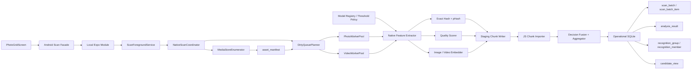
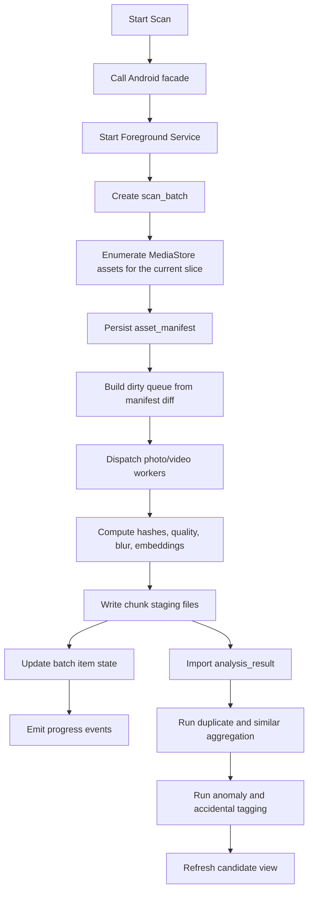
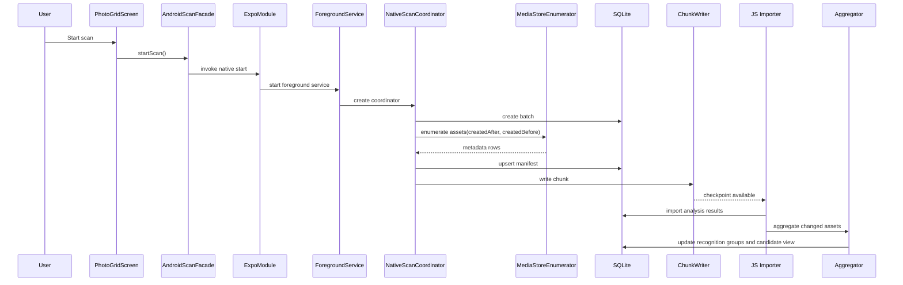

# Android-First Scan And Recognition Architecture

中文版本: [architecture.md](./architecture.md)

Related goals: [Android Scan And Recognition Target-State Goals](./target-state-goals.en.md)
Related research: [Algorithm Research](./algorithm-research.en.md)

## Background

The target state is now explicit: Android is the primary execution surface, enumeration is metadata-first, and SQLite is the durable runtime truth.

This document explains how the Android-first architecture satisfies those goals.

## Core Decisions

1. `PhotoGridScreen` is the control surface.
2. Android Native Module + Foreground Service is the execution surface.
3. SQLite is the durable Android runtime truth.
4. JS handles orchestration, chunk import, UI updates, and business presentation.

## Phase Model

The Android pipeline is permanently split into:

1. `enumeration`
2. `analysis`
3. `aggregation`

Enumeration produces `asset_manifest`, analysis produces `analysis_result`, and aggregation produces `recognition_group`, `recognition_member`, and `candidate_view`.

## Scan Window Policy

The Android-first scan window should follow one stable rule:

1. start with the default last-12-month window, with `1/2/3/6/12` month presets available
2. after one window completes, continue with the next older history slice instead of widening forever
3. enumerate each history slice with both lower and upper bounds
4. once no older media remains, fall back to incremental processing for only new or changed assets

## Algorithm Layer

Based on the research document, the Android target stack should separate:

1. blur scoring
2. exact and near-duplicate hashing
3. semantic similarity embeddings
4. accidental and low-information tagging
5. no-reference quality scoring

## First Release Without AI

The current delivery decision is to ship v1 without AI in the critical path.

So the v1 path becomes:

1. blur: `S3 + JNB-style blur score`
2. duplicate: `SHA-256 + pHash`
3. near-similar: `pHash distance + metadata proximity + low-level feature distance`
4. accidental / low-information: `rules gating`
5. low quality: `BRISQUE / NIQE`

In v1:

1. `embedding_vector_ref` may remain as a future-facing field but is not required by the critical path
2. `model_registry` is reserved for a later phase
3. similarity should be interpreted as near-similarity, not strong semantic similarity

## Architecture Diagram

## Flow Diagram

## Sequence Diagram

## Primary Tables

1. `scan_batch`
2. `scan_batch_item`
3. `asset_manifest`
4. `analysis_result`
5. `recognition_group`
6. `recognition_member`
7. `candidate_view`
8. `asset_state`
9. `user_decision`
10. `recycle_bin_state`
11. `cleanup_report`
12. `scan_baseline`
13. `model_registry`

The implemented v1 follow-up is the first restore projection: `PhotoScanResultCache` is now persisted into SQLite `candidate_view / candidate_view_meta`, and page re-entry uses that projection as the primary source for active candidates and summary. If the AsyncStorage compatibility mirror is newer, restore selects the newest result by `scannedAt`. This does not replace the final aggregation truth; `analysis_result`, full `recognition_group` aggregation, and policy-level `user_decision` extensions still belong to later waves.

Wave 3 adds the first normalized duplicate-group truth: when `PhotoScanResultCache` is saved, each candidate `duplicateGroup` is extracted into `recognition_group / recognition_member`. This establishes the durable group shape without rewriting aggregation or pulling full similar/anomaly grouping into scope.

Wave 4 adds the minimum `user_decision` truth: `syncPersistedMediaLedger` records keep, recycle, restore, permanent delete, and failed outcomes into SQLite. These records survive scan-cache clearing so rebuilt recognition output does not overwrite user intent.

Restore decisions are written only when the recycle-bin UI explicitly passes `restoredIds`; ordinary active scan results update the candidate ledger but do not infer user restore intent.

## iOS Boundary

1. Android may adopt AI earlier, but contracts such as `analysis_result`, `model_version`, and `threshold_version` should remain platform-neutral.
2. iOS should reuse the same model and threshold semantics where possible, while swapping only the execution adapter layer.
3. Android-specific foreground-service and delegate choices should not leak into the recognition data model.
