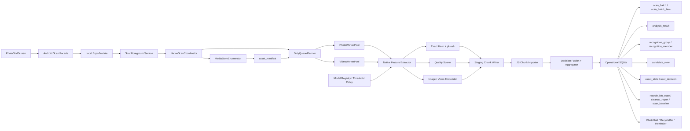
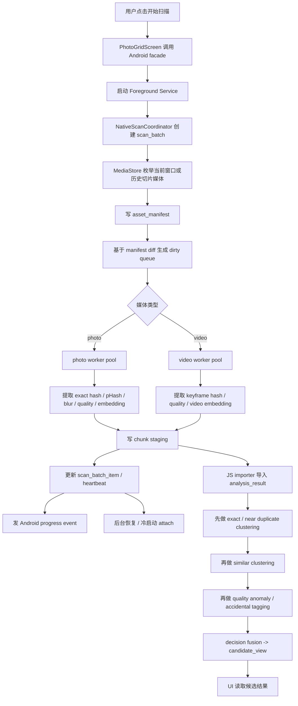
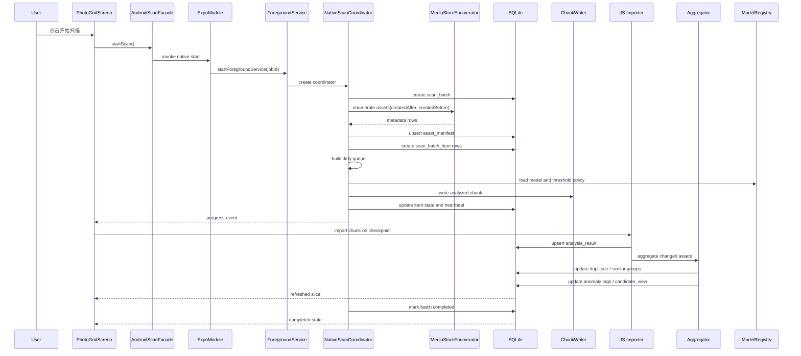
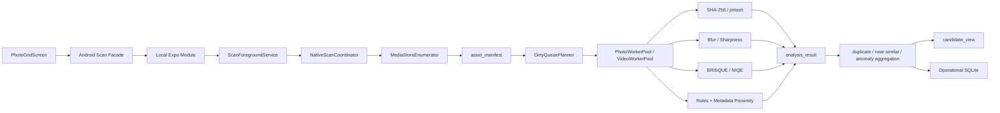

# Android First 扫描与识别架构

English version: [architecture.en.md](./architecture.en.md)

关联目标文档：[Android 扫描与识别终态需求目标](./target-state-goals.md)
关联调研文档：[Android 识别算法调研](./algorithm-research.md)

## 背景

终态目标已经明确：Android 必须成为扫描与识别的唯一主执行面，扫描必须 metadata-first，SQLite 必须升级为 durable runtime truth。

这份文档只回答一件事：**如何用 Android-first 架构满足这些终态目标。**

## 设计结论

### 1. Android 是唯一主执行面

1. `PhotoGridScreen` 是控制面。
2. Android Native Module + Foreground Service 是执行面。
3. SQLite 是 Android 运行时 durable truth。
4. JS 负责发起任务、接收进度、导入 chunk、驱动 UI、承接业务层表达。

### 2. 扫描必须 metadata-first

终态扫描不能从“直接分析 asset”开始，而必须从 `MediaStore manifest enumeration` 开始。

枚举阶段先读元数据，再根据：

- 新增资源
- 元数据变化
- 缺失分析结果
- 算法版本升级

生成 dirty queue。

### 3. Android 扫描拆成三段

终态 Android 扫描固定拆成：

1. `enumeration`
2. `analysis`
3. `aggregation`

其中：

- `enumeration` 产出 `asset_manifest`
- `analysis` 产出 `analysis_result`
- `aggregation` 产出 `recognition_group / recognition_member / candidate_view`

### 4. 扫描窗口必须是“最近 12 个月起步 + 历史切片回填”

Android 第一版扫描窗口策略固定为：

1. 默认先扫最近 `12` 个月，设置页可改成 `1/2/3/6/12` 个月。
2. 当前窗口完成后，下一次扫描不回到刚处理过的范围，而是继续扫描上一批之前的历史切片。
3. 每个历史切片都要同时带 `createdAfter` 与 `createdBefore` 两侧边界，避免窗口无限膨胀。
4. 当更早历史已经没有媒体时，后续扫描退回“只处理新增或变化媒体”的增量模式。

## 架构图

## 流程图

## 时序图

## 数据层设计

### 1. `scan_batch`

记录一次扫描批次的来源、范围、阶段、进度、错误和完成状态。

### 2. `scan_batch_item`

记录每个 asset 在当前批次中的阶段、尝试次数、失败原因和最近 heartbeat。

### 3. `asset_manifest`

记录 Android 枚举阶段读出来的元数据真值，包括尺寸、文件大小、时长、时间戳、目录、视频字段和 dirty reason。

### 4. `analysis_result`

记录单资源分析结果，包括：

- `exact_hash`
- `perceptual_hash`
- `embedding_vector_ref`
- `blur_score`
- `quality_score`
- `accidental_score`
- `fingerprint / frame fingerprints`
- `analysis_version / model_version`

### 5. `recognition_group` / `recognition_member`

记录 duplicate / similar / anomaly 的聚合分组和成员关系。

当前已落地的是 duplicate group 的最小规范化真值：保存 `PhotoScanResultCache` 时，从候选项里的 `duplicateGroup` 抽取 `recognition_group / recognition_member`。这一步只建立 durable group 形态，不重写算法，也不把 similar / anomaly 的完整分组一并拉进来。

### 6. `candidate_view`

记录 UI 直接消费的候选视图，避免页面每次都从底层表现场拼装。

当前已落地的是第一层恢复投影：`PhotoScanResultCache` 写入 SQLite `candidate_view / candidate_view_meta`，页面再次进入时以 SQLite 投影为主恢复 active candidates 与 summary；若 AsyncStorage 兼容镜像更新，则按 `scannedAt` 仲裁最新结果。它不是最终聚合真值替代品；`analysis_result`、完整 `recognition_group` 聚合与 `user_decision` 策略化扩展仍需后续波次补齐。

### 7. `asset_state` / `user_decision`

把资产当前状态和用户动作解耦，避免识别结果覆盖用户决策。

当前已落地的是 `user_decision` 最小真值：`syncPersistedMediaLedger` 在用户 keep、移动到回收站、从回收站恢复、永久删除、失败记录时写入 SQLite。它不随 `clearPersistentScanCache` 清理，避免扫描结果重建时冲掉用户动作。

恢复决策只能由回收站 UI 显式传入 `restoredIds` 写入；普通 active 扫描结果只更新候选 ledger，不推断用户 restore intent。

### 8. `model_registry`

记录 AI 模型和阈值策略，包括：

- `model_family`
- `model_version`
- `delegate_policy`
- `threshold_version`
- `enabled_dimensions`

## 识别算法分层

基于调研结论，Android 终态算法层建议这样拆：

1. `模糊`
   - JNB / HiFST / S3 这类传统 sharpness 和 blur 路线
2. `重复`
   - exact duplicate: `SHA-256`
   - near duplicate: `pHash`
3. `相似`
   - `Image Embedder + cosine similarity`
4. `误触 / 低信息`
   - `rules + lightweight classifier`
5. `噪声重 / 差质`
   - `BRISQUE / NIQE / camera-captured IQA`
   - optional `NIMA` re-rank

## 第一版无 AI 落地

当前落地决策是：第一版先不上 AI。

所以第一版主链路收口为：

1. `模糊`
   - `S3 + JNB-style blur score`
2. `重复`
   - `SHA-256 + pHash`
3. `近相似`
   - `pHash distance + metadata proximity + low-level feature distance`
4. `误触 / 低信息`
   - `rules gating`
5. `差质`
   - `BRISQUE / NIQE`

第一版里：

1. `embedding_vector_ref` 允许保留为未来字段，但不是必填主链路字段。
2. `model_registry` 作为后续扩展位保留，不要求第一版实现。
3. `similar` 在第一版按 near-similar 解释，不按强语义相似解释。

## 第一版无 AI 架构图

## AI 模型层

### 1. 推荐默认栈

Android 默认 AI 栈建议：

1. `MediaPipe Image Embedder`
2. `MediaPipe Image Classifier` 或 LiteRT/TFLite Task Library 自定义分类头
3. `MobileNetV3-Small` 级别的轻量模型

但这部分是第二阶段增强位，不属于第一版主链路。

### 2. 执行策略

1. 先走传统特征和哈希。
2. 再对 hard case 跑 embedding / classifier。
3. delegate 优先级由设备能力决定：
   - CPU baseline
   - GPU / NNAPI optional
4. delegate 失败必须自动 fallback。

### 3. 不推荐的做法

1. 不把 CLIP 类模型作为 Android 默认实时主链路。
2. 不让 AI 输出直接跳过 aggregation。
3. 不把所有维度都压成一个总分。

### 4. 对 iOS 的影响边界

1. Android 可以先行引入 AI，但 `analysis_result`、`model_version`、`threshold_version` 这些契约应保持平台无关。
2. iOS 后续接入时，优先复用同一组模型语义和阈值语义，只替换执行适配层。
3. Android-specific 的 `Foreground Service` 和 delegate 策略不能泄漏到识别数据模型里。

## 关键取舍

1. 不让 JS 页面承担长期后台执行。
2. 不让单资源分析直接生成最终 duplicate / similar 结论。
3. 不按窗口复制 `analysis_result`，窗口影响的是“这次扫谁”，不是“资产特征属于谁”。
4. 允许 `candidate_view` 作为 UI 投影视图存在，但真值仍在 manifest、analysis、group、decision 层。
5. AI 是增强层，不是第一真值来源。

## 下一步实现入口

1. `scan-window-storage`
2. `asset_manifest`
3. `scan_batch / scan_batch_item`
4. metadata-first enumeration
5. Android Native Foreground Service execution
6. second-stage aggregation
