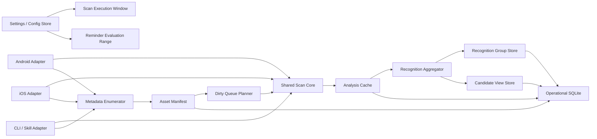
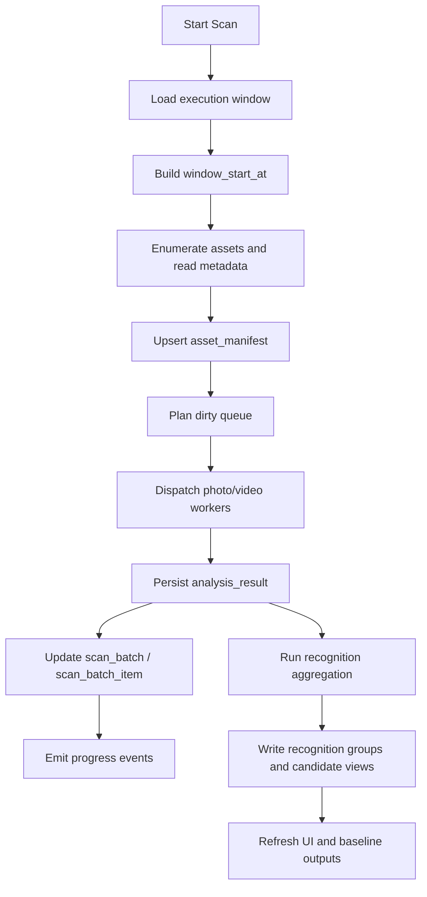
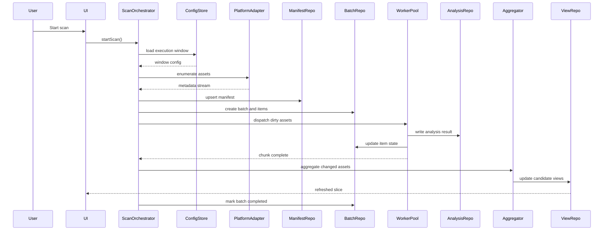

# Target-State Scan And Recognition Architecture

中文版本: [README.md](./README.md)

## Background

This document defines the long-term target-state architecture for scan and recognition in `app-cleaner`, instead of being constrained by the current transitional implementation.

The target state assumes:

1. daily scans use a configurable rolling execution window
2. full-library scans are only used for baseline establishment, repair, or backfill
3. metadata such as media dimensions must be read and persisted during enumeration
4. duplicate and similar detection is produced by a second-stage aggregation layer
5. user decisions are fully decoupled from recognition truth

## Core Decisions

### 1. Six-layer architecture

The target state is split into:

1. `Config Layer`
2. `Platform Adapter Layer`
3. `Shared Scan Core`
4. `Operational Store`
5. `Aggregation Layer`
6. `View / Decision Layer`

### 2. Separate execution window from reminder range

- `Scan Execution Window`: rolling `N` days, such as `30 / 60 / 90 / 180 / 365`
- `Reminder Evaluation Range`: `1 / 2 / 3 / 6 / 12 months`

They must not share one storage key or one baseline meaning.

### 3. Metadata-first scanning

Enumeration must read and persist:

- `asset_id`
- `media_type`
- `width`
- `height`
- `aspect_ratio`
- `orientation`
- `duration_ms`
- `file_size_bytes`
- `creation_time`
- `modified_time`
- `source_uri / local_uri`
- optional video fields such as `bitrate / codec / frame_rate`

### 4. Global per-asset analysis cache

The scan window only decides which assets are scanned now.
Per-asset analysis remains global and reusable across windows and batches.

### 5. Second-stage aggregation

Single-asset analysis only outputs raw metadata, metrics, and fingerprints.
`duplicate / similar / anomaly` truth is produced by the aggregation layer.

## Architecture Diagram

## Flow Diagram

## Sequence Diagram

## Target Data Model

Recommended long-term tables:

1. `app_meta`
2. `scan_batch`
3. `scan_batch_item`
4. `asset_manifest`
5. `analysis_result`
6. `recognition_group`
7. `recognition_member`
8. `asset_state`
9. `user_decision`
10. `recycle_bin_state`
11. `cleanup_report`
12. `scan_baseline`

## Review Focus

Please review these decisions:

1. metadata such as dimensions and size must be read during enumeration
2. rolling windows should not duplicate analysis cache
3. duplicate and similar recognition should move into second-stage aggregation
4. long-term storage should be centered on `scan_batch + asset_manifest + analysis_result + recognition_group`
5. the long-term architecture should converge on `shared core + platform adapter`
