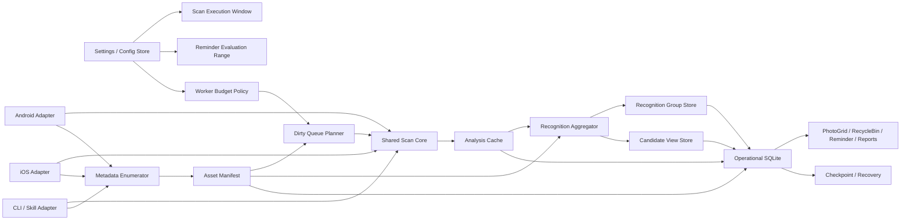
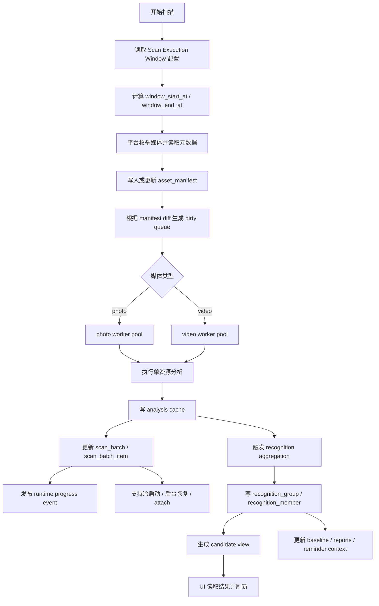
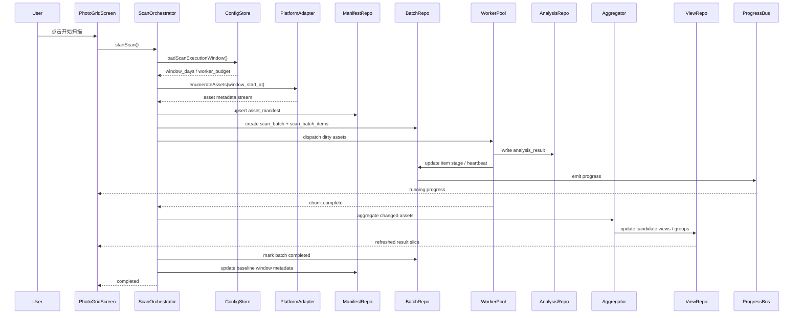

# 终态扫描与识别架构

English version: [README.en.md](./README.en.md)

## 背景

本文档不再以当前过渡实现为上限，而是直接定义 `app-cleaner` 的长期终态扫描与识别架构。

这份设计默认以下前提成立：

1. 日常扫描默认不是全库重扫，而是基于可配置执行窗口的 rolling scan。
2. 全量扫描只用于建立全库基线、迁移、修复或算法升级后的回填。
3. 扫描阶段必须读取并持久化媒体元数据，不仅包括 `asset id / 时间 / 类型`，还包括：
   - 尺寸：`width / height`
   - 文件大小：`file_size_bytes`
   - 时长：`duration_ms`
   - 方向与比例：`orientation / aspect_ratio`
   - 可选扩展：`bitrate / codec / frame_rate / subtype`
4. duplicate / similar 不在单资源分析阶段直接输出最终真值，而是交给聚合阶段统一计算。
5. 用户决策状态必须和识别结果彻底解耦。

这份文档优先回答三个问题：

1. 终态系统应该如何分层。
2. 扫描时必须读取哪些数据，以及何时读取。
3. 流程图、时序图、架构图分别应该长什么样。

## 目标

终态系统的目标不是“现在代码先跑”，而是长期具备以下能力：

1. 支持 Android / iOS / CLI / skill 共用一套扫描与识别核心。
2. 支持可配置的“最近 N 天扫描窗口”，而不污染 reminder 配置。
3. 支持全量基线、增量扫描、局部修复、算法回填。
4. 支持大库规模下的持久化、恢复、进度追踪与局部重算。
5. 支持扫描阶段就拿到媒体尺寸等元数据，并在后续评分、排序、清理建议中复用。

## 终态设计结论

### 1. 架构分层

终态分为 6 层：

1. `Config Layer`
2. `Platform Adapter Layer`
3. `Shared Scan Core`
4. `Operational Store`
5. `Aggregation Layer`
6. `View / Decision Layer`

### 2. 配置彻底拆分

必须分离两种范围配置：

1. `Scan Execution Window`
   - 语义：这次扫描实际覆盖最近多少天
   - 推荐 preset：`30 / 60 / 90 / 180 / 365`
2. `Reminder Evaluation Range`
   - 语义：最近几个月内是否有新增媒体，从而决定是否提醒
   - 继续沿用 `1 / 2 / 3 / 6 / 12 months`

两者不能共享 storage key，也不能共享 baseline 语义。

### 3. 扫描时必须先读元数据

终态扫描不是“先拿一堆 asset id，再按需补字段”，而是先做 `manifest enumeration`。

枚举阶段必须读取并落库：

- `asset_id`
- `platform_local_id`
- `media_type`
- `width`
- `height`
- `aspect_ratio`
- `orientation`
- `duration_ms`
- `file_size_bytes`
- `creation_time`
- `modified_time`
- `source_uri` 或 `local_uri`
- `album_ids` 或平台等价分组信息（可选）
- `subtype_flags`
  - `screenshot`
  - `screen_recording`
  - `live_photo`
  - `burst`
  - `favorite`
  - `hidden`
- 可选扩展元数据
  - `bitrate`
  - `codec`
  - `frame_rate`

这些字段属于扫描输入真值，而不是后续分析附属物。

### 4. 分析缓存是全局 per-asset 真值

`analysis cache` 不按窗口复制。

窗口只决定：

- 这次 batch 枚举哪些资产
- 哪些资产进入 dirty queue

但单资源分析结果属于全局缓存，后续不同窗口、不同批次、不同平台都复用同一份真值。

### 5. duplicate / similar 必须二阶段聚合

单资源分析阶段只产出：

- metadata
- visual metrics
- hash / fingerprint
- frame fingerprints

最终的：

- duplicate group
- similar group
- anomaly group

全部在聚合阶段统一生成。

### 6. 用户状态独立于识别结果

终态必须把以下两类状态分开：

1. `recognition truth`
   - 系统识别结果
2. `user decision`
   - keep
   - recycle
   - delete
   - ignore / false positive

否则算法升级、窗口变化、回填重扫会覆盖用户决策。

## 组件架构图



## 流程图



## 时序图



## 终态数据模型

### 配置模型

推荐终态配置结构：

```ts
type ScanExecutionWindowDays = 30 | 60 | 90 | 180 | 365;

interface ScanExecutionConfig {
  mode: 'rolling-days';
  days: ScanExecutionWindowDays;
}

interface ReminderEvaluationConfig {
  months: 1 | 2 | 3 | 6 | 12;
}

interface WorkerBudgetConfig {
  photoConcurrency: number;
  videoConcurrency: number;
  maxCpuFraction: number;
}
```

### 扫描输入契约

```ts
interface AssetManifestRecord {
  assetId: string;
  platformLocalId: string;
  mediaType: 'photo' | 'video';
  width: number;
  height: number;
  aspectRatio: number;
  orientation: 'portrait' | 'landscape' | 'square' | 'unknown';
  durationMs: number;
  fileSizeBytes: number;
  creationTime: number;
  modifiedTime: number | null;
  sourceUri: string | null;
  localUri: string | null;
  subtypeFlags: string[];
  codec: string | null;
  bitrate: number | null;
  frameRate: number | null;
  firstSeenAt: number;
  lastSeenAt: number;
  isDeleted: boolean;
  dirtyReason: 'new' | 'modified' | 'missing-analysis' | 'algorithm-upgrade' | null;
  metadataSignature: string;
  updatedAt: number;
}
```

这里要强调：

1. `width / height / fileSizeBytes / durationMs` 是必填核心字段。
2. `aspectRatio / orientation` 在枚举时就能计算出来，不应拖到后续视图层。
3. `codec / bitrate / frameRate` 是视频扩展字段，允许平台能力不足时为 `null`。

### 分析结果契约

```ts
interface AnalysisResultRecord {
  assetId: string;
  analysisVersion: string;
  sourceBatchId: string;
  fingerprint: string | null;
  differenceHash: string | null;
  contentHash: string | null;
  frameFingerprints: string[];
  metrics: {
    brightness: number;
    contrast: number;
    edgeDensity: number;
  };
  status: 'ok' | 'fallback';
  updatedAt: number;
}
```

### 聚合结果契约

```ts
interface RecognitionGroupRecord {
  groupId: string;
  kind: 'duplicate' | 'similar' | 'anomaly';
  score: number;
  representativeAssetId: string;
  sourceBatchId: string;
  status: 'active' | 'stale';
  updatedAt: number;
}

interface RecognitionMemberRecord {
  groupId: string;
  assetId: string;
  similarity: number | null;
  role: 'representative' | 'member';
  updatedAt: number;
}
```

### 用户决策契约

```ts
interface UserDecisionRecord {
  assetId: string;
  decision: 'keep' | 'recycle' | 'delete' | 'ignore';
  source: 'manual' | 'auto-cleanup';
  reason: string | null;
  updatedAt: number;
}
```

## 终态 SQLite 表设计

长期终态推荐表：

1. `app_meta`
2. `scan_batch`
3. `scan_batch_item`
4. `asset_manifest`
5. `analysis_result`
6. `recognition_group`
7. `recognition_member`
8. `asset_state`
9. `user_decision`
10. `recycle_bin_state`
11. `cleanup_report`
12. `scan_baseline`

### 表职责说明

#### `scan_batch`

记录：

- `batch_id`
- `mode`
  - `full`
  - `rolling-window`
  - `repair`
  - `backfill`
- `scan_window_days`
- `scan_window_start_at`
- `scan_window_end_at`
- `phase`
  - `enumerating`
  - `analyzing`
  - `aggregating`
  - `completed`
  - `failed`
- `progress_current`
- `progress_total`
- `started_at`
- `ended_at`

#### `scan_batch_item`

记录单资产在本批次里的执行状态：

- `batch_id`
- `asset_id`
- `stage`
- `attempt_count`
- `worker_slot`
- `last_error`
- `updated_at`

#### `asset_manifest`

记录所有媒体资源的轻量元数据与 dirty 状态。
这是后续所有扫描计划的输入真值。

#### `analysis_result`

记录单资源分析真值。
不按窗口复制。

#### `recognition_group / recognition_member`

记录聚合后的识别结果。
duplicate / similar / anomaly 都从这里出，不再混在 ledger 或临时 links 表里。

#### `asset_state`

记录系统当前理解的资源状态，例如：

- `active`
- `recycled`
- `deleted`
- `error`

#### `user_decision`

记录用户动作，不被算法升级覆盖。

#### `scan_baseline`

记录最近一次有效基线：

- `baseline_type`
  - `full`
  - `rolling-window`
- `scan_window_days`
- `scan_window_start_at`
- `latest_eligible_asset_at`
- `ledger_updated_at`

## 执行策略

### 1. 默认扫描模式

终态默认：

- `rolling-window`

只有以下场景才进入 `full` 或 `repair`：

1. 首次建库
2. 大版本算法升级
3. 用户明确要求全库复查
4. manifest / analysis 数据损坏修复

### 2. 多 worker 策略

终态必须区分：

- `photo worker pool`
- `video worker pool`

不允许所有媒体共享一个固定并发值。

推荐执行规则：

1. `photoConcurrency` 随设备能力提升可增加
2. `videoConcurrency` 始终显著低于照片
3. worker budget 不应占满整机资源
4. progress 以 chunk 或 item boundary 持久化，而不是每一步都写数据库

### 3. metadata-first 原则

尺寸、大小、时长等元数据属于枚举阶段输入，不应等到分析阶段才被动发现。

原因：

1. 可用于更早地做 batch planning
2. 可用于 worker weighting
3. 可用于无需解码的初筛规则
4. 可用于排序与候选解释

例如：

- 超大视频可被优先标记为高成本资产
- 极小尺寸图片可单独走低价值规则
- 横纵比异常可参与 screenshot / accidental heuristics

## 与当前仓库的差异

当前 live 仓库与终态相比，主要差异在：

1. 当前仍由 JS 主导扫描控制流，终态应以 shared core + adapter 为主。
2. 当前 SQLite 偏 operational cache，终态应升级为 batch-first 真值库。
3. 当前 `scan_job` 过轻，终态必须升级到 `scan_batch + scan_batch_item`。
4. 当前 `media_links` 过于轻量，终态应由 `recognition_group / recognition_member` 接管。
5. 当前 90 天窗口还是硬编码行为，终态必须变成正式配置。

## 实施建议

长期终态建议按以下顺序落地：

### Wave 1：配置正式化

1. 引入独立 `scan execution window`
2. 让当前 `hardcoded 90 days` 正式配置化
3. baseline / session / result cache 补窗口元信息

### Wave 2：manifest + batch

1. 引入 `asset_manifest`
2. 引入 `scan_batch / scan_batch_item`
3. 让扫描恢复以 batch 为真相，不再只依赖 `scan_job`

### Wave 3：aggregation

1. duplicate / similar 二阶段聚合
2. 引入 `recognition_group / recognition_member`
3. UI 基于 candidate view 读结果

### Wave 4：shared core

1. Android adapter
2. iOS adapter
3. CLI / skill adapter
4. 统一 shared scan core

## 本轮评审问题

请重点看下面几个设计判断是否接受：

1. 是否接受“扫描时先读并持久化媒体尺寸、大小、时长等元数据”。
2. 是否接受“滚动窗口只决定本次扫描谁，不复制 analysis cache”。
3. 是否接受“duplicate / similar 全部改成二阶段聚合”。
4. 是否接受“长期终态直接以 `scan_batch + asset_manifest + analysis_result + recognition_group` 为核心模型”。
5. 是否接受“终态 shared core + platform adapter”的总架构方向。

Design complete. Continue with superpowers:writing-plans to convert this into an executable plan.
