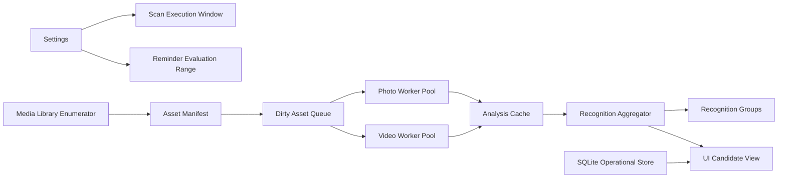
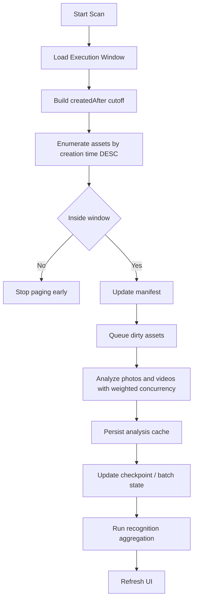

# Recognition And Scan Design

中文版本: [README.md](./README.md)

## Background

This document isolates the current `app-cleaner` scan and recognition pipeline and proposes the target design for future work on:

- configurable rolling scan windows
- SQLite expansion
- Android native-first execution
- long-term recognition architecture

## Scope

The current repository already contains:

- JS scan pipeline
- Android native-first facade
- SQLite operational store
- scan progress checkpointing
- reminder baseline handling

The main architectural problem is that scan execution, reminder evaluation, baseline semantics, and long-term aggregation are still only partially separated.

## Recommended Direction

### 1. Separate execution window from reminder range

- `Scan Execution Window`: rolling `N` days, for example `30 / 60 / 90 / 180 / 365`
- `Reminder Evaluation Range`: `1 / 2 / 3 / 6 / 12 months`

They must not share one storage key.

### 2. Keep global analysis cache

The rolling window should only decide **which assets are scanned now**.

It should not duplicate per-window analysis cache rows.
Per-asset analysis remains global and reusable across future windows.

### 3. Introduce a batch-first execution model

Future storage should evolve from:

- `scan_job`

to:

- `scan_batch`
- `scan_batch_item`

This enables durable recovery, per-item retry, and clearer progress truth.

### 4. Split aggregation from single-asset analysis

`duplicate / similar` should move into a second-stage aggregation layer:

- `recognition_group`
- `recognition_member`

This is necessary for incremental scans and local recomputation.

## Architecture Overview

## Scan Flow

## Recommended Rollout

1. Configure scan execution window as a dedicated setting.
2. Add window metadata to cached scan results and baselines.
3. Introduce `asset_manifest` and `scan_batch`.
4. Move duplicate/similar into a separate aggregation layer.
5. Keep Android native-first execution compatible with the same contracts.

## Review Focus

Please review the following decisions:

1. whether the execution window presets should be `30 / 60 / 90 / 180 / 365`
2. whether full-library scanning should only be used for baseline establishment
3. whether duplicate/similar should become second-stage aggregation
4. whether `scan_job` should evolve into `scan_batch + scan_batch_item`
