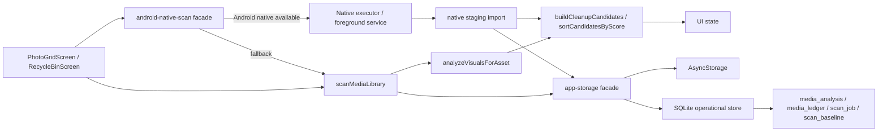
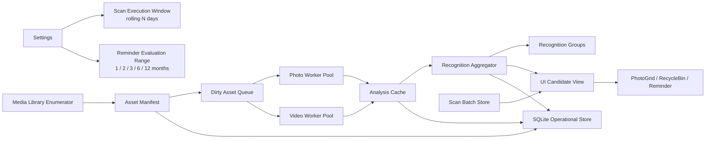
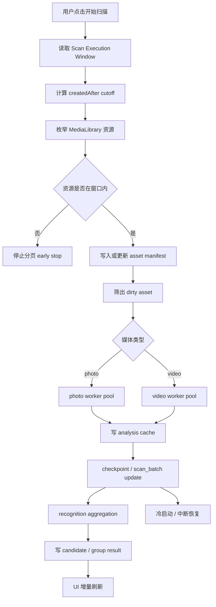
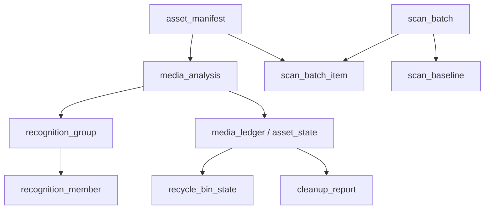

# 识别与扫描设计

English version: [README.en.md](./README.en.md)

## 背景

本文档单独整理 `app-cleaner` 当前“媒体扫描 + 识别 + 持久化 + UI 进度”链路，并给出后续可演进的目标设计，便于围绕识别效率、窗口配置、SQLite 扩展和 Android native-first 执行继续评审。

当前仓库已经具备以下基础：

- JS 扫描主链路：`src/features/scan/scan-media-library.ts`
- Android native-first facade：`src/features/scan/android-native-scan.ts`
- 本地运营库：`src/services/storage/sqlite/operational-store.ts`
- 扫描页入口：`src/ui/screens/PhotoGridScreen.tsx`
- 回收站重扫：`src/ui/screens/RecycleBinScreen.tsx`
- 提醒与基线：`src/services/notifications/cleanup-reminders.ts`

但当前仍存在 4 个关键问题：

1. 扫描执行窗口、提醒判断范围、扫描基线语义还没有彻底分层。
2. 现有 SQLite 更像 operational cache，还不是 batch-first 的扫描真值模型。
3. duplicate / similar 仍然偏向首阶段直接得出结果，不利于增量扫描。
4. JS / Android native / UI 进度恢复虽然已经打通，但缺少统一的长期架构说明。

## 目标

本设计聚焦以下目标：

1. 扫描执行默认支持“最近 N 天滚动窗口”，并允许后续配置化。
2. 全量扫描只作为基线建立手段，不作为日常默认路径。
3. 扫描、识别、持久化、UI 进度与提醒基线彻底解耦。
4. 为后续 SQLite 扩展、Android native-first 执行器和 Rust shared core 预留稳定边界。

## 当前架构

### 当前状态解读

1. JS 仍然掌握核心扫描控制流。
2. Android 原生执行已进入 facade + staging import 模式，但结果消费仍回到 JS 业务层。
3. SQLite 目前承接的是：
   - `media_analysis`
   - `media_ledger`
   - `scan_baseline`
   - `recycle_bin_state`
   - `cleanup_report`
   - `scan_job`
4. `AsyncStorage` 仍然承接部分 session cache、scan range、reminder settings 等轻量配置。

## 设计原则

1. 扫描执行窗口与提醒判断范围必须分离。
2. 分析缓存必须是全局 per-asset 真值，不按窗口复制。
3. duplicate / similar 必须从“单资源分析”中拆成“二阶段聚合结果”。
4. UI 进度以 runtime event 为主，SQLite checkpoint 为恢复真相。
5. 全量扫描建立基线，日常扫描只处理 rolling window 与 dirty asset。

## 推荐目标架构

### 目标分层

#### 1. 配置层

- `Scan Execution Window`
  - 决定扫描默认覆盖“最近多少天”
  - 推荐配置：`30 / 60 / 90 / 180 / 365`
- `Reminder Evaluation Range`
  - 决定提醒判断“最近几个月内是否有新媒体”
  - 继续沿用当前 `1 / 2 / 3 / 6 / 12 months`

这两层不能再共享同一个 storage key。

#### 2. Manifest 层

职责：记录库里“有哪些资源，以及它们最近一次被看见的轻量元数据”。

推荐未来新增表：

- `asset_manifest`

关键字段建议：

- `asset_id`
- `media_type`
- `width`
- `height`
- `duration`
- `file_size`
- `creation_time`
- `last_seen_at`
- `is_deleted`
- `dirty_reason`
- `updated_at`

#### 3. Batch 层

职责：把“一次扫描”真正建模成可恢复、可观察、可重试的批次。

推荐未来新增：

- `scan_batch`
- `scan_batch_item`

当前 `scan_job` 可以作为过渡表，但不是终态。

#### 4. Analysis Cache 层

职责：缓存单资源分析结果，只在资源变化或算法版本变化时重算。

现有 `media_analysis` 可以演进承接：

- `asset_id`
- `signature`
- `fingerprint`
- `difference_hash`
- `content_hash`
- `frame_fingerprints_json`
- `metrics_json`
- `analysis_version`
- `source_batch_id`
- `updated_at`

#### 5. Aggregation 层

职责：基于 analysis cache 做 duplicate / similar / abnormal 的二阶段聚合。

推荐未来新增：

- `recognition_group`
- `recognition_member`

不要继续让 `media_links` 既承担轻量关联，又承担完整聚合真相。

## 扫描执行流程

### 流程关键点

1. `createdAfter` 是执行窗口，不是 reminder range。
2. early stop 依赖 `creationTime DESC` 分页顺序，命中旧资产即可停止后续枚举。
3. photo / video 并发应分开控制，不共享一个固定值。
4. progress update 分成两条线：
   - runtime event：给前台 UI
   - SQLite checkpoint：给恢复与后台 attach
5. duplicate / similar 不在单资源阶段直接固化最终结论，而是进入聚合阶段。

## 推荐的数据结构

### 未来表职责建议

#### `asset_manifest`

记录资源目录与 dirty 状态。

#### `scan_batch`

记录：

- 扫描模式：`full / rolling-window / repair`
- 扫描窗口：`scan_window_days / scan_window_start_at`
- 扫描阶段：`enumerating / analyzing / aggregating / completed / failed`
- 进度与统计

#### `scan_batch_item`

记录单资源执行状态：

- `asset_id`
- `stage`
- `attempt_count`
- `last_error`
- `worker_slot`
- `updated_at`

#### `media_analysis`

保存单资源分析真值，不按窗口分副本。

#### `recognition_group / recognition_member`

保存聚合后的组与成员关系，支撑局部重算。

## 为什么“最近 N 天”能提速

真正的收益来源不是“线程更多”，而是“重活更少”：

1. 资源枚举更少
2. 图片/视频分析更少
3. UI 进度更新范围更小
4. 聚合只处理窗口内 dirty asset 与受影响 group
5. 已有全库 analysis cache 可复用

### 前提条件

要想真正提速，必须同时满足：

1. rolling window 只决定“这次扫描谁”
2. 全局 analysis cache 仍然保留
3. duplicate/similar 在聚合层仍可对比历史基线

否则只扫最近 N 天会导致跨窗口重复漏识别。

## 配置设计建议

### 扫描执行窗口

推荐新增独立存储：

- `app-cleaner/scan-window-days`

推荐值：

- `30`
- `60`
- `90`
- `180`
- `365`

### 提醒判断范围

继续沿用当前：

- `app-cleaner/scan-range`

语义仍为：

- `1 / 2 / 3 / 6 / 12 months`

### 切换配置后的行为

#### 缩小窗口

例如 `90 -> 30`：

1. 不清全局 analysis cache
2. 清当前 UI 结果缓存
3. 下一次扫描只枚举最近 30 天
4. baseline 与 result cache 带上新的窗口元信息

#### 放大窗口

例如 `30 -> 90`：

1. 不清全局 analysis cache
2. 下一次扫描补扫 `30~90` 天区间资产
3. duplicate/similar 仍然可以利用既有全局特征缓存

## 分阶段落地建议

### Wave 1：执行窗口配置化

目标：

1. 新增 `scan-window-storage.ts`
2. 用配置替换当前 hardcoded `90 days`
3. `PhotoScanResultCache / SessionSnapshot / Baseline` 带上窗口元信息
4. Settings UI 拆出“扫描范围”与“提醒范围”

### Wave 2：批次化与 manifest 化

目标：

1. 引入 `asset_manifest`
2. 引入 `scan_batch / scan_batch_item`
3. `scan_job` 退化为兼容层或迁移入口
4. checkpoint 改为真正批次模型

### Wave 3：聚合层拆分

目标：

1. 增加 `recognition_group / recognition_member`
2. duplicate / similar 改成二阶段聚合
3. `media_links` 退化成轻量关系表或兼容视图

### Wave 4：Android native-first + shared core

目标：

1. Android executor 彻底主导资源枚举和分析
2. JS 主要负责业务聚合与 UI
3. 为 Rust shared core 预留稳定协议边界

## 当前推荐结论

我建议当前仓库按下面这个结论推进：

1. **短期**：先完成“扫描执行窗口配置化”，不要继续混用 reminder range。
2. **中期**：把 `scan_job` 扩成 `scan_batch + scan_batch_item`。
3. **长期**：把 duplicate / similar 拆进聚合层，并为 Android native / Rust shared core 统一数据契约。

## 评审重点

这份设计建议重点围绕下面几个问题评审：

1. 扫描执行窗口 preset 是否用 `30/60/90/180/365`
2. 是否接受“全量分析缓存保留，全量扫描仅做基线建立”
3. 是否接受 duplicate / similar 二阶段聚合，而不是首阶段直接出最终真相
4. 是否接受 `scan_job -> scan_batch` 的数据模型升级

Design complete. Continue with superpowers:writing-plans to convert this into an executable plan.
